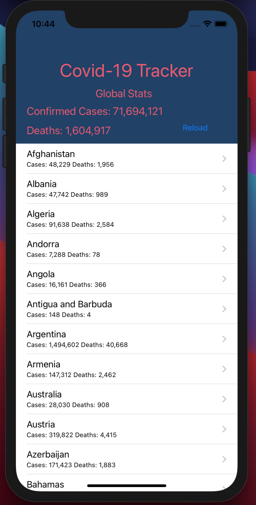
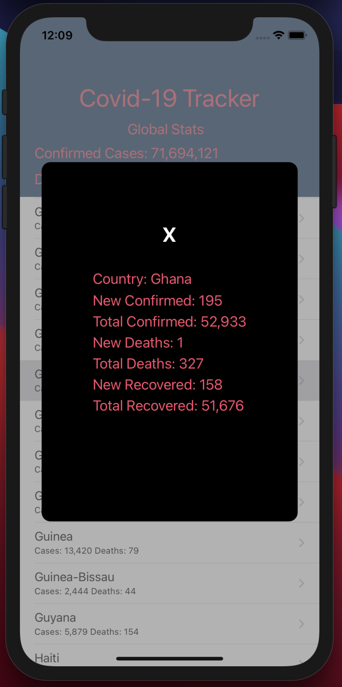

# ios-portfolio

- CovidTracker

This app uses vanilla iOS frameworks to fetch and display Covid-19 world stats from covid19api.com. An interesting thing learned here was using a subview to gray out the main tableView and prevent the user from activating extra cells. 

| Main View  | Cell tapped |
|------------|-------------|
|  |  |
